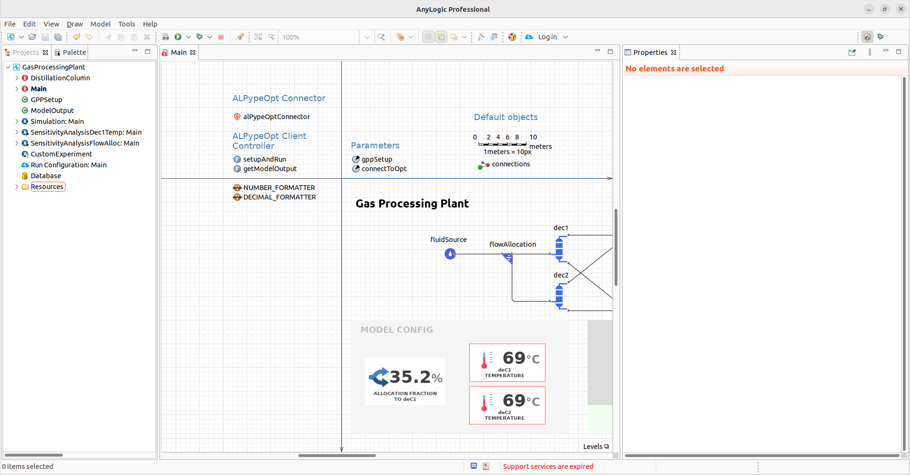

# ALPypeOpt

**ALPypeOpt** or _AnyLogic Python Pipe for Optimization_ is an open source library for connecting **AnyLogic** simulation models with python-based **black box optimization** packages such as `scikit-optimize`, `optuna` , `hyperopt` and `bayesian optmization`.


With **ALPypeOpt** you will be able to:

* Connect your AnyLogic model to a *black box optimization* package of your choice (e.g. scikit-optimize ``skopt``).
* **(IN PROGRESS)** Scale your optimization loop by launching many AnyLogic models simultaneously (*requires an exported model*).
* Debug your AnyLogic models during optimization loop (*this special feature improves the user experience during model debugging remarkably*).
* Leverage on the AnyLogic rich visualization as the optimization runs (*which ties to the previous bullet point*).

There is a more comprehensive [documentation](https://alpypeopt.readthedocs.io/en/latest/) available that includes numerous examples to help you understand the basic functionalities in greater detail.

_NOTE: ALPypeOpt has been engineered as a framework that is independent of any specific black box optimization package. This design facilitates its compatibility with a wide range of state-of-the-art optimization packages._

## Environments

_ALPypeOpt_ includes 2 environments that make the connection between _AnyLogic_ and your _python script_ possible:

* [ALPypeOptConnector](https://alpypeopt.readthedocs.io/en/latest/AnyLogicConnector.html) - The AnyLogic connector ('agent') library to be dropped into your simulation model.
* [alpypeopt](https://alpypeopt.readthedocs.io/en/latest/GasProcessingPlant.html) - The library that you will use after configuring your _optimization solver_ in your python script to connect to the AnyLogic model. 

## Installation

To install the base **ALPypeOpt** library in python, use `pip install alpypeopt`.

To use **ALPypeOptConnector** in _AnyLogic_, you can add the [library](https://github.com/MarcEscandell/ALPypeOpt/tree/main/bin) to your _Palette_. That will allow you to drag and drop the connector into your model. _Note that further [instructions](https://alpypeopt.readthedocs.io/en/latest/AnyLogicConnector.html) are required to be followed in order for the connector to work_.


## Requirements

* The **ALPypeOpt** requires you to have the **AnyLogic software** (or a valid exported model). AnyLogic is a licensed software for building simulations that includes an ample variety of libraries for modelling many industry challenges. At the moment, AnyLogic provides a *free* license under the name PLE (Personal Learning Edition). There are other options available. For more information, you can visit the [AnyLogic website](https://www.anylogic.com/).

_Note: This is not a package that is currently backed by the AnyLogic support team._

* The python package `alpypeopt` doesn't require any additional dependencies other that the black box optimization package of your choice:

    * _E.g._: ``scikit-optimize``

## API basics

### Optimization loop

To be able to solve an _optimization problem_, you must have the following:

* An **AnyLogic model** that requires certain parameters to be set at the beggining of the run and will impact the overall goal. Using the [Gas Processing Plant](https://alpypeopt.readthedocs.io/en/latest/GasProcessingPlant.html) example, a decision must be taken on the plant setup in order for the _total revenue_ to be maximized. For that, the AnyLogic model will be consuming any setup passed to the **ALPypeOptConnector** and returning the newely calculated _revenue_.



* A **python script** that contains the optimization algorithm. Here is where the optimal solution will be computed. For that, you will need to create an instance (to handle the connection) of the AnyLogic model and encapsulate it under a function that can be consumed by the optimization package that you have chosen to use:

```python
from alpypeopt import AnyLogicModel
from skopt import gp_minimize

gpp_model = AnyLogicModel(
    env_config={
        'run_exported_model': False,
        'exported_model_loc': './resources/exported_models/gas_processing_plant',
        'show_terminals': False,
        'verbose': False
    }
)

# Initialize model setup
gpp_setup = gpp_model.get_jvm().gasprocessingplant.GPPSetup()
# Start setting up gas product prices
gpp_setup.setProductPrices(30.0, 10.0)
# Create input variable ratios as (min, max)
# GPU 1&2 plant load ratios
plant_load_ratio = (0.01, 0.99)
# GPU 1&2 distillation column operating temperature
gpp_opp_temp_ratio = (20.0, 100.0)
bounds = [
    plant_load_ratio,       # dec1 flow allocation
    gpp_opp_temp_ratio,     # dec1 temperature
    gpp_opp_temp_ratio      # dec2 temperature
]

# Encapsulate simulation model as a python function
def simulation(x, reset=True):
    # Setup selected plant loads and temperatures
    gpp_setup.setFlowAllocRateToDec1(x[0])
    gpp_setup.setDecTemperatures(x[1], x[2])
    # Pass input setup and run model until end
    gpp_model.setup_and_run(gpp_setup)
    # Extract model output or simulation result
    model_output = gpp_model.get_model_output()
    if reset:
        # Reset simulation model to be ready for next iteration
        gpp_model.reset()
    # Return simulation value. 'skopt' package only allows minimization problems
    # Because of that, value must be negated
    return -model_output.getTotalRevenue()

# Setup and execute black box optimmization model
res = gp_minimize(simulation,         # the function to minimize
                  bounds,             # the bounds on each dimension of x
                  acq_func="EI",      # the acquisition function
                  n_calls=10,         # the number of evaluations of simulation
                  n_random_starts=5,  # the number of random initialization points
                  random_state=1234)  # the random seed

# Print optimal solution
print(f"Solution is {res.x} for a value of {-res.fun}")

# Run simulation with optimal result to use UI to explore results in AnyLogic
simulation(res.x, reset=False)

# Close model
gpp_model.close()
```

## Bugs and/or development roadmap

At the moment, ALPypeOpt is at its earliest stage. You can join the [alpypeopt project](https://github.com/MarcEscandell/ALPypeOpt/discussions) and raise bugs, feature requests or submit code enhancements via pull request.

## Support ALPypeOpt's development

If you are financially able to do so and would like to support the development of **ALPypeOpt**, please reach out to marcescandellmari@gmail.com.

## License

The ALPypeOpt software suite is licensed under the terms of the Apache License 2.0. See [LICENSE](https://github.com/MarcEscandell/ALPypeOpt/blob/main/LICENSE) for more information.

