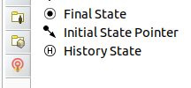
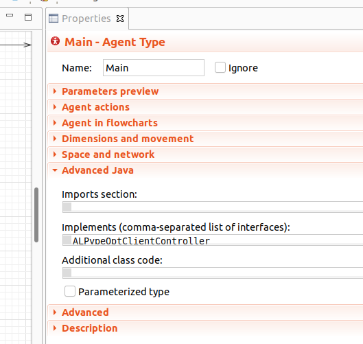

######################
The AnyLogic Connector
######################

This page will guide you through the process of setting up your **connection** from the **AnyLogic side**. To help make the explanation more clear, we will be using the :ref:`Gas Processing Plant example<How to optimize your simulation model. The GPP example.>`.

.. note::
    You may find the source code of the *Gas Processing Plant* `here <https://github.com/MarcEscandell/ALPypeOpt/tree/main/alpypeopt/examples/gas_processing_plant/GasProcessingPlant>`__.

The summary of steps required to follow are:

1. Add **ALPypeOpt Connector Library** to your *AnyLogic Palette*.
2. Drag and drop an instance of **ALPypeOptConnector** to your **root** (also defaulted as ``Main`` the first time you create a model).
3. Add ``ALPypeOptClientController`` interface to the list of interfaces in your **root** agent and **implement** the required functions.

****************************************************************
Add ``ALPypeOptConnector`` library to your **AnyLogic Palette**
****************************************************************

To begin, you must add the **ALPypeOpt Connector Library** to your AnyLogic *Palette*. If you are not familiar with AnyLogic, this step is quite straightforward. You simply need to locate the green cross at the end of the *Palette* screen (the location of the *Palette* may vary based on your AnyLogic view arrangement, but it is usually presented on the left-hand side together with the *Projects* structure).

.. image:: images/add_new_library_anylogic_palette.png
    :alt: Add new library to AnyLogic Palette

Once you have located the green cross, click on it and select *Manage Libraries…*. Then, click on the *Add* button and select the :download:`ALPypeLibrary.jar <../bin/anylogic-8.8/ALPypeLibrary.jar>` file. Note that this is a link to download a library that was generated and is **only compatible with AnyLogic 8.8.x**. There is also a link :download:`ALPypeLibrary.jar <../bin/anylogic-8.7/ALPypeLibrary.jar>`  to the library **compatible with AnyLogic 8.7.x**.

You should now be able to see the newely added library in your list of available libraries at the *Palette*.

****************************************************
Drag and drop an instance of ``ALPypeOptConnector``
****************************************************

Now that you have access to the **ALPypeOpt Connector** from *AnyLogic*, you can proceed by dragging and dropping an instance of it into your model.

.. warning::
    Please note that when creating a *custom library* in *AnyLogic*, the **additional required dependencies** are not included in the package by default. While that remains a problem, you will need to **include them manually**. 

    You can download them `here <https://github.com/MarcEscandell/ALPypeOpt/tree/main/bin/lib>`__.
    
    Just click your project on the *Projects* tab and go to *Properties*. There you can add other dependencies manually at *Jar files and class folders required to build the model* as shown in the image:

    .. image:: images/alpypeopt_dependencies.png
        :alt: ALPypeOpt jar dependencies

It's important to note that you should place the connector in your **root** agent. If you're not familiar with *AnyLogic*, the root agent is the one that usually holds and compiles the other objects in your simulation (it's like the *home* for everything else). 

.. tip:: 
    Another reference you can use to identify the *root* agent, it's the one that you select when you set up your ``Simulation`` experiment as the *Top-level agent*. See the image below:
    
    .. image:: images/root_agent.png
        :alt: AnyLogic root agent

****************************************
Implement ``ALPypeOptClientController``
****************************************

This is a very important step in order for the *ALPypeOpt Connector* to understand what it needs to do when the optimization python script is executed.

First, you must add ``ALPypeOptClientConnector`` to the list of interfaces of your **root** agent. To do this, first click on a random point in the canvas of your *root* agent (usually named as ``Main``) and then navigate to the *Properties* page. Scroll down to find the section *Advanced Java*. You should be able to see *Implements (comma-separated list of interfaces)*. Then you can add ``ALPypeOptClientController``.

Next, if you try to compile your model, you will be getting at least 2 new errors as shown in the image:

These errors indicate that, if you plan to implement the interface, you must also implement these functions (it's kind of a contract that you have decided to sign).

You can now drag and drop 2 new functions. Their arguments and return types must be as follows (otherwise the compilation error won't go away):

* ``boolean setupAndRun(Object modelConfig)``: This function is called by the *optimization algorithm* so the AnyLogic model (or simulation) consumes the  values (that come from the python black box optimizer) and subsequently runs until the end (whichever simulation lenght has been defined). The argument of the function is of a generic type ``Object`` so any custom class defined by the consumer (AnyLogic model) can be passed. 
  
  In the *Gas Processing Plant* example, a tailored-to-the problem class has been created: ``GPPSetup``. This class contains functionalities to help set and manage data related to the specific problem of a *GPP*. For example, there are methods available such as ``setFlowAllocRateToDec1(double flowAllocFractionToDec1)`` and ``setDecTemperatures(double dec1Temperature, double dec2Temperature)``. However, to be able to access such methods, the ``modelConfig`` argument must be parsed to the right type. In order for such parsing to work, additional configuration must be implemented and followed on the python side. The works of it will be explained later. Here's the AnyLogic function body (as an example):

    .. code-block:: java

        try {
            // Parse object input into custom model input setup
            GPPSetup gppSetup = (GPPSetup) modelConfig;
            // Store settings in model parameter
            this.gppSetup = gppSetup;
            // Process configuration:
            // Allocate flow fraction and distillation columns fractions
            flowAllocation.set_fraction1(gppSetup.getFlowAllocFractionToDec1());
            flowAllocation.set_fraction2(1 - gppSetup.getFlowAllocFractionToDec1());
            dec1.set_temperature(gppSetup.getTemperatureDeC1());
            dec2.set_temperature(gppSetup.getTemperatureDeC2());
            
            // Everything went fine!
            return true;
            
        } catch (Exception e) {
            error("Something went wrong when processing model input. Error catched was: " + e.getMessage());
        }

        return false;

* ``Object getModelOutput()``: This function returns an object containing information about the output of the model. Just as before, the return type is of a generic type ``Object`` which allows any custom created class to be passed. 

  In the *Gas Processing Plant* example, a custom class ``ModelOutput`` has been created. In this class, you can find methods such as ``double getTotalRevenue()`` or ``double getProduction1()``. Such methods will be then called from the python script.

  The function body is pretty simple:

    .. code-block:: java

        // Collect model output and return
        ModelOutput modelOutput = new ModelOutput(this);

        return modelOutput;

  which is constructed as follows:

    .. code-block:: java
        
        // [...]

        /**
        * Default constructor
        */
        public ModelOutput(Main gppModel) {
            this.gppSetup = (GPPSetup) gppModel.alPypeOptConnector.getModelConfig();
            this.gppModel = gppModel;
            // Compute model margin
            totalRevenue = gppModel.totalProduct1.amountPassed() * gppSetup.getProduct1Price()
                        + gppModel.totalProduct2.amountPassed() * gppSetup.getProduct2Price();
            
        }

        // [...]