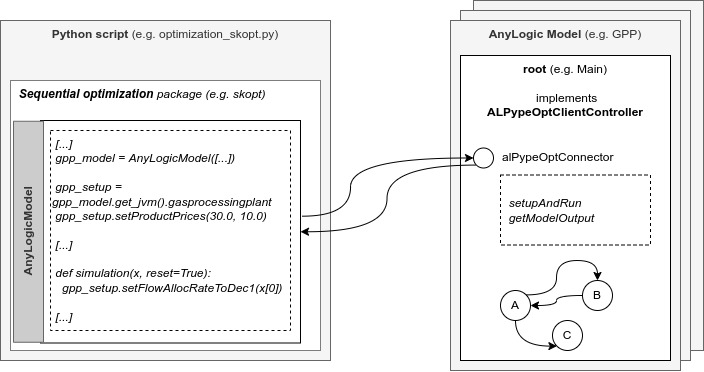

#########
ALPypeOpt
#########

**ALPypeOpt** or *AnyLogic Python Pipe for Optimization* is an open source library that will allow you to create and run optimization experiments using simulations build in the AnyLogic software. AnyLogic is a powerful software that is used to develop high-fidelity system simulations that can represent reality in as much detail as the developer desires.

.. important::
    *Sequential optimization* is a mathematical field that is constantly evolving and improving. The aim of **ALPypeOpt** is to create a framework that is agnostic to the solver and facilitates the integration with as many state-of-the-art optimization packages as possible written in python.

***********
Features
***********
With **ALPypeOpt** you will be able to:

* Connect your AnyLogic model to a *sequential optimization* package of your choice (e.g. scikit-optimize ``skopt``).
* **(IN PROGRESS)** Scale your optimization loop by launching many AnyLogic models simultaneously (*requires an exported model*).
* Debug your AnyLogic models during optimization loop (*this special feature improves the user experience during model debugging remarkably*).
* Leverage on the AnyLogic rich visualization as the optimization runs (*which ties to the previous bullet point*).

************
Environments
************

*ALPypeOpt* includes 2 environments that make the **connection between AnyLogic and your python scrip** possible:

* :ref:`ALPypeOptConnector<The AnyLogic Connector>`. The **AnyLogic connector** library to be dropped into your simulation model.
* :ref:`alpypeopt<How to optimize your simulation model. The GPP example.>`. The library that you will use after configuring your optimization solver in your python script to connect to the AnyLogic model. 

************
Installation
************

* You must add ``ALPypeOptConnector`` in your **AnyLogic Palette**. Download the **jar** file :download:`here<../bin/ALPypeOptLibrary.jar>` and follow the :ref:`instructions<The AnyLogic Connector>`.

    .. image:: images/alpypeopt_library.png
        :alt: ALPypeOpt Library

    .. warning::
        **The** ``ALPypeOptConnector`` **requires additional configuration steps!** It is not enougth to drag and drop an instance. Please read the :ref:`documentation<The AnyLogic Connector>`.

* To install the base **alpypeopt** library in python, use:

    .. code-block:: console
        
        pip install alpypeopt

************
Requirements
************

* The **ALPypeOpt** requires you to have the **AnyLogic software** (or a valid exported model). AnyLogic is a licensed software for building simulations that includes an ample variety of libraries for modelling many industry challenges. At the moment, AnyLogic provides a *free* license under the name PLE (Personal Learning Edition). There are other options available. For more information, you can visit the `AnyLogic website <https://www.anylogic.com/>`_.

.. note::
    This is not a package that is currently backed by the AnyLogic support team.

* Besides the python package ``alpypeopt``, you will need to install your *sequential optimization* package of choice (e.g. scikit-optimize ``skopt``)

********************
General architecture
********************

The ALPypeOpt library consists of 2 artifacts (as mentioned earlier):

* The **ALPypeOpt Connector** or **SIMULATION**. If you are familiar with the AnyLogic terms, this object has been basically built from a base ``Agent``. It is in charge of creating a connection from the **java** side.
  
* The python **alpypeopt** package or **OPTIMIZATION**. This library will create the connection from the **python** side. In the same script, you will define and configure your optimization solver.

Here there's an overall diagram to how *ALPypeOpt* connection is built:

